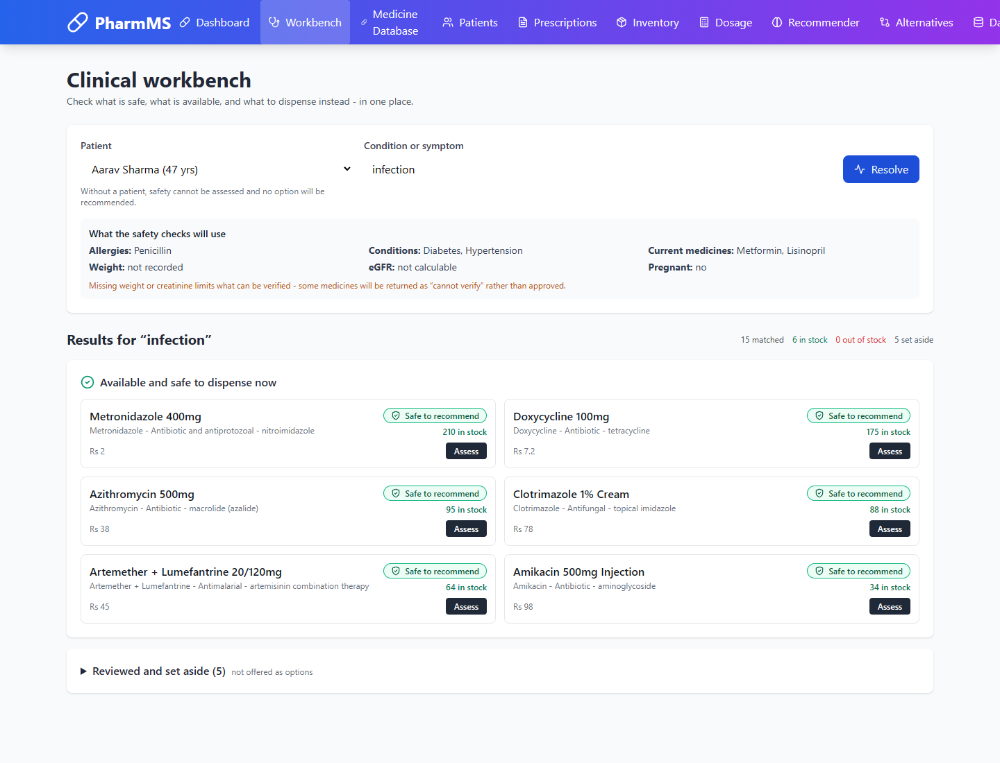

# PharmMS — Pharmacy Management System

<p align="center">
 
</p>

<p align="center">
 <strong>Offline pharmacy management software for Windows.</strong><br>
  Inventory, patients, prescriptions, dosing reference and printed reports —
  all on your own computer, with no internet connection required.
</p>

<p align="center">
 <a href="../../releases/latest"><strong>⬇ Download the installer</strong></a>
</p>

---

## Download and install

1. Go to the [latest release](../../releases/latest)
2. Download **`PharmMS-Setup.exe`**
3. Double-click it and click **Install**

That is the whole process. No Python, no Node.js, **no administrator rights**,
and no internet connection are needed at any point.

The installer adds a **PharmMS** shortcut to your Desktop and Start Menu, and
registers itself under *Apps & features* so you can uninstall it normally.

> **Windows SmartScreen:** the installer is not code-signed, so Windows may warn
> you on first run. Click **More info** → **Run anyway**. Code signing needs a
> paid certificate — [open an issue](../../issues) if you would like it added.

### Where your data lives

Your records are stored at `%LOCALAPPDATA%\PharmMS\pharmacy.db` — deliberately
**outside** the program folder. Upgrading, reinstalling or moving the
application never touches your patient data, and uninstalling asks before
deleting anything.

---

## What it does

| Area | What you get |
|---|---|
| **Medicine database** | 116 curated medicines across 96 therapeutic classes, with molecular formulas, formula weights, manufacturers and drug licence numbers, Indian Pharmacopoeia and BP/USP monograph references, mechanism of action, pharmacokinetics, pregnancy categories, HSN/GST and schedule classification. Coverage is weighted toward Indian community practice: the NTEP antitubercular drugs, the artemisinin combinations, ORS and zinc, the anthelmintics, and the fixed-dose combinations Indian general practice prescribes |
| **Patients** | Records with allergy tracking that flags **within-class cross-reactivity** — a penicillin allergy correctly blocks amoxicillin — plus weight, serum creatinine, hepatic and renal status, and pregnancy/lactation, which the dosing and safety checks depend on |
| **Clinical workbench** | One screen for the whole counter decision: what is safe, what is in stock, what to substitute, and how long to take it for |
| **Safety engine** | Every recommendation is gated. Graded verdicts (contraindicated / serious / caution / safe / **cannot verify**), covering allergy cross-reactivity, comorbidity conflicts, serious drug interactions, Beers Criteria for the over-65s, paediatric age limits, pregnancy and lactation, renal dosing by eGFR, hepatic impairment and dose ceilings |
| **Prescriptions** | Write, screen and print. Safety checks run live as you add each medicine |
| **Printed reports** | Prescriptions and full patient histories on **your own pharmacy letterhead** with your logo. Prescriptions follow the classical pharmacopoeial structure — superscription (℞), inscription, subscription, signatura — with the statutory **Schedule H1 red-box warning**, prescriber registration number and dual signature blocks |
| **Dosage calculator** | Weight-based (mg/kg) paediatric dosing where a published figure exists, falling back to Young's rule and labelling the confidence honestly. Capped at the maximum single dose, so a heavy child cannot be handed an adult overdose |
| **Alternatives finder** | "What else treats this?" — ranked by how little clinical substitution is needed, screened against the patient |
| **Substitutions** | When the first choice is out of stock: same-molecule swaps first, then genuine therapeutic alternatives. Every candidate is safety-screened for *this* patient, and anything unsafe is excluded rather than merely warned about |
| **Administration cycles** | Course length, dose interval, clock times, tapering requirements and missed-dose advice, derived per drug class so a 5-day antibiotic and a 5-day steroid are not printed as the same thing |
| **Live reference (optional)** | Off by default and offline-first. Looks a drug up in the FDA's public labelling database, caches it locally, and keeps working without a connection once fetched. Only the drug name is ever sent |
| **Inventory** | Stock levels, batch and expiry tracking, low-stock alerts, valuation in ₹ |
| **Backups** | Automatic snapshots on every launch, plus one-click export and restore |

### Built for offline use

The application makes **no internet requests of its own**. No CDN fonts, no
analytics, no telemetry, no cloud sync. It runs normally with networking
completely disabled, which is what a pharmacy counter needs.

The **only** feature that can use the network is the optional live reference
lookup, and it is off unless you turn it on. When it is on:

- only the **drug name** is ever sent — never a patient identifier, never a
  record from your database
- every result is **cached to disk**, so a drug you have looked up once keeps
  working with no connection
- if the network is unavailable, the cached copy is used; if there is no cached
  copy you are told plainly that live data is unavailable, rather than being
  shown an empty result that looks like "no warnings"

Fetched data is reference material, never a recommendation, and is deliberately
**not** fed into the recommendation engine — a label written for another
jurisdiction is not a substitute for the curated, safety-screened set.

---

## Custom branding — ₹500 one-time

Want the app and every printed prescription to carry **your pharmacy's name and
logo** instead of the default?

1. Open PharmMS and go to the **Branding** tab
2. Enter your pharmacy name and the licence key issued for it
3. Upload your logo, add your address, phone, drug licence number and GSTIN

Your details then appear on the app's startup screen and on every printed
prescription and patient report.

**Request a key** by [opening an issue](../../issues/new) with your pharmacy
name and your payment reference. It is a **one-time ₹500**. Keys are:

- **Bound to your pharmacy name** — a key issued for one shop will not work for another
- **Verified offline** — no activation server, no phone-home, works without internet
- **Yours to keep** — moving to a new computer just means entering the same key again

The app stays fully functional without a key; it simply keeps the default
branding. **Nothing about patient care, records or printing is gated** — only
your pharmacy's own name and logo.

> **Payment is handled separately.** This repository contains no payment
> processing. Open an issue with your pharmacy name and the maintainer will
> reply with payment instructions and your key.

---

## Documentation
| Document | For |
|---|---|
| [`INSTALLATION_GUIDE.md`](INSTALLATION_GUIDE.md) | Installing, uninstalling, backing up, moving to a new PC |
| [`USAGE_GUIDE.md`](USAGE_GUIDE.md) | A walkthrough of every screen in the app |
| [`DEVELOPER_NOTES.md`](DEVELOPER_NOTES.md) | Building, publishing, licence keys, bug history |

---

## Licence and source access

PharmMS is **proprietary source-available** software. It is **not** open
source, and it is not covered by Apache, MIT or any similar permissive licence.
The full terms are in [`LICENSE`](LICENSE); the short version is:

| | |
|---|---|
| **Running the application** | Free, including commercial pharmacy use |
| **Reading the source** | On request — see below |
| **Copying or modifying the source** | Not permitted |
| **Redistributing the source or a modified build** | Not permitted |
| **Removing attribution or the integrity seals** | Not permitted |

### Requesting source access

The source is shared with people who have a specific reason to read it — a
pharmacy integrating it, a developer doing technical due diligence, or a reviewer
checking the dosing and safety logic.

1. Open an issue titled **Source access request** at
   <https://github.com/Storm-21/Pharm_MS/issues/new>
2. Say who you are and what you intend to do with the code.
3. You will get read access and the design notes for the dosing and safety engines.

Access is granted for reading, evaluation and integration work. It does not
transfer ownership, and it does not permit redistributing a modified copy as
PharmMS.

> **Note on what GitHub can and cannot enforce.** A public repository is visible
> and clonable by anyone, and GitHub has no setting that makes a repository
> readable but not downloadable. The licence above is therefore a legal
> restriction rather than a technical one — it says clearly what is and is not
> allowed, and it is enforceable, but it cannot physically prevent a determined
> person from copying a public repository. Keeping the repository private is the
> only technical control that does. See `DEVELOPER_NOTES.md` for the options.

---

## Screenshots


*See `docs/img/` for the full set. They are taken from the shipping build, not
mockups.*

---

## Project website

The landing page lives in [`docs/`](docs/) and is published with GitHub Pages —
no build step, no framework, no CDN, and no JavaScript. That is deliberate: a
site advertising offline-first software should not itself depend on a network
fetch to render.

It is deployed automatically by `.github/workflows/pages.yml` on any push to
`main` that touches `docs/`. **One-time setup:** in the repository, go to
*Settings → Pages → Build and deployment → Source* and select **GitHub
Actions**. After that the site is live at
`https://<your-username>.github.io/pharms/`.

The deploy job verifies the site before publishing — every image referenced by
the page must exist, and the download button must point at a release asset —
because a landing page with a dead download link is worse than no page at all.

---

## For developers

<details>
<summary><strong>Build from source</strong></summary>

Requires Python 3.10+, Node.js 18+ and Windows.

```powershell
# Backend
cd backend
python -m venv venv
.\venv\Scripts\python.exe -m pip install -r requirements.txt

# Frontend
cd ..\frontend
npm install
npm run build
cd ..\backend

# Application + installer
.\build_exe.ps1            # -> dist\PharmMS.exe   (the application)
.\build_installer.ps1      # -> dist\PharmMS-Setup.exe (the distributable)
```

### Running in development

```powershell
# Terminal 1 - API on :5000
cd backend
.\venv\Scripts\python.exe run.py

# Terminal 2 - React dev server on :3000 (hot reload)
cd frontend
npm start
```

</details>

<details>
<summary><strong>Tests</strong></summary>

```powershell
cd backend
.\venv\Scripts\python.exe test_safety.py      # 26 cases: the safety gate
.\venv\Scripts\python.exe test_migration.py   # schema upgrade on a live database
```

The safety suite is the one that matters most. It asserts that dangerous
combinations are **blocked**, not merely flagged:

- a penicillin allergy blocks amoxicillin through cross-reactivity
- warfarin is contraindicated in pregnancy
- aspirin under 16 is a hard stop (Reye's syndrome)
- metformin without a recorded creatinine returns *cannot verify* rather than
  safe, because it genuinely cannot be verified
- a calculated dose above the ceiling is reduced, not printed

The migration test runs against a **copy** of a populated database, rolls it
back to the old schema, then verifies the file itself gained the new columns and
lost no records. It reads the database back over an independent connection,
which is the check that catches a migration reporting success while writing
nothing.

</details>

<details>
<summary><strong>Project structure</strong></summary>

```
PharmacyMS/
├── backend/
│   ├── app/
│   │   ├── branding.py          creator identity, sealed
│   │   ├── licensing.py         licence keys + pharmacy branding
│   │   ├── security.py          per-record integrity seals
│   │   ├── migrations.py        adds new columns to an existing database
│   │   ├── data/                medicine reference set (batches 1-3) + seeder
│   │   ├── models/              Medicine, Patient, Prescription, Inventory
│   │   ├── routes/              REST API blueprints
│   │   └── services/
│   │       ├── safety_service.py           the gate every recommendation passes
│   │       ├── dosage_service.py           weight-based dosing, ceilings
│   │       ├── substitution_service.py     what to dispense when it is not in stock
│   │       ├── administration_service.py   course length, timing, tapering
│   │       ├── live_reference_service.py   optional openFDA lookup + cache
│   │       ├── recommender_service.py      ranking
│   │       └── storage_service.py          backups / export
│   ├── desktop_app.py           native window entry point
│   ├── build_exe.ps1            build the application
│   ├── build_installer.ps1      build the setup .exe
│   ├── create_github_repo.ps1   create the GitHub repo + first release
│   ├── publish_github.ps1       push code and upload a release
│   ├── import_medicines.py      bulk catalogue importer
│   └── make_logo.py             regenerate logo assets
├── .github/workflows/
│   └── build-installer.yml      CI: build the .exe on a tag push
└── frontend/
    └── src/pages/                dashboard, medicines, patients,
                                  prescriptions, inventory, dosage,
                                  recommender, alternatives, data, branding
```

</details>

<details>
<summary><strong>Adding medicines in bulk</strong></summary>

The shipped database is a curated, verified dispensing set. To load national
coverage, import a real catalogue — CDSCO approved-drug lists, the Jan Aushadhi
catalogue, NPPA ceiling-price lists, or your own distributor sheet:

```powershell
cd backend
.\venv\Scripts\python.exe import_medicines.py --file catalogue.csv --dry-run
.\venv\Scripts\python.exe import_medicines.py --file catalogue.csv
```

CSV or JSON, flexible column names (`MRP`, `Company`, `Indications`, `Generic
Name` are all recognised). **Rows missing a required field are rejected with a
reason** rather than padded with placeholders — a half-empty record must never
enter a clinical database looking complete.

</details>

<details>
<summary><strong>Publishing to GitHub</strong></summary>

### First time — create the repository and ship a release
```powershell
$env:GITHUB_TOKEN = "ghp_your_token"     # repo scope
cd backend
.\create_github_repo.ps1 -Repo "yourname/pharms"
```

That single command creates the GitHub repository, connects `origin`, commits
the source, builds `PharmMS-Setup.exe` and publishes it as a release asset.
Add `-DryRun` first to see every step without contacting GitHub, or
`-SkipRelease` to publish the code without building the installer.

### Later releases
```powershell
cd backend
.\publish_github.ps1 -Repo "yourname/pharms" -Tag v2.0.1
```

### Releases built by GitHub, not by you
`.github/workflows/build-installer.yml` builds the installer on GitHub's own
Windows runners and attaches it to the release. **Push an annotated tag and the
installer appears, with nothing built on your machine:**

```powershell
git tag v2.0.0
git push origin v2.0.0
```

You can also run it by hand from *Actions → Build installer → Run workflow*; the
installer is then downloadable from the run's *Artifacts* section even without a
release.

The workflow needs no secrets — it uses the automatic `GITHUB_TOKEN` — and it
runs the same `build_installer.ps1` you do, so a green build proves the
documented command works.

Your database, `.env` files and the private key-issuing tool are excluded by
`.gitignore` — patient data must never reach a public repository.

</details>

---

## Medical disclaimer
This software is a record-keeping and decision-support tool. **None of it is a
substitute for professional clinical judgement.**

**What it does do.** The safety engine is deliberately pessimistic: when it
cannot prove a medicine is safe for a specific patient it returns
*cannot verify*, and that verdict is treated as unsafe for the purpose of
recommendation. A missed contraindication harms a patient, so the engine never
returns "safe" by default — it starts from not-proven-safe and only relaxes
when a check actively passes. Only a fully clean assessment is ever recommended
automatically; anything less is surfaced for a human to decide on.

**What it cannot do.** It knows only what has been recorded. A medicine can be
returned as "cannot verify" because a weight, creatinine, pregnancy status or
allergy has not been entered — recording it is what resolves the verdict. It has
no knowledge of anything not in the record, including over-the-counter products
the patient has not mentioned.

**Before relying on any of it:**

- Every calculated dose is an estimate and must be verified by a qualified
  prescriber. Weight-based doses are only as good as the recorded weight.
- Verify all medicine data against the current edition of the relevant
  pharmacopoeia and the manufacturer's labelling. Live-fetched reference data
  comes from a different regulatory jurisdiction and is reference material
  only.
- Substitution suggestions are suggestions. Anything above a same-molecule swap
  requires the prescriber's confirmation.
- The interaction and contraindication tables are curated and therefore
  incomplete by nature. Absence of a warning is not evidence of safety.

---

**Designed & Developed by Jayant**
